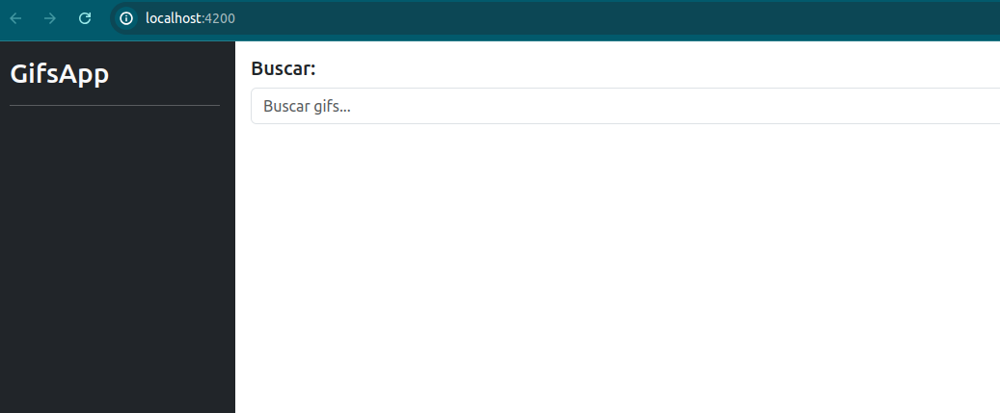

# GifsApp Angular

This is a simple Gifs app using Angular and the API of Giphy

## Example of use

Search something

You can return to a previous search

## Run code 

Make sure to use at least v18.13. of Node.js, you can upgrade using `nvm use 20.12.2`

Run `npm start`

